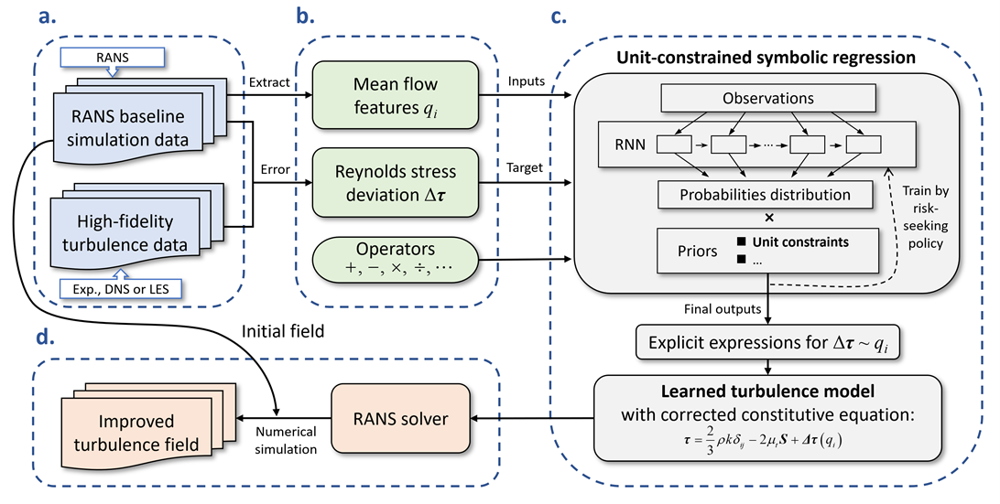

# Interpretable data-driven turbulence modeling for separated flows using symbolic regression with unit constraints

Machine learning techniques have been applied to enhance turbulence modeling in recent years. However, the "black box" nature of most machine learning techniques poses significant interpretability challenges in improving turbulence models. This paper introduces a novel unit-constrained turbulence modeling framework using symbolic regression to overcome these challenges. The framework amends the constitutive equation of linear eddy viscosity models (LEVMs) by establishing explicit equations between the Reynolds stress deviation and mean flow quantities, thereby improving the LEVM model's predictive capability for large separated turbulence. Unit consistency constraints are applied to the symbolic expressions to ensure physical realizability. The effectiveness of the framework and the generalization capability of the learned model are demonstrated through its application to the separated flow over 2D periodic hills and a backward-facing step. Compared to the standard k-ε model, the learned model shows significantly improved predictive accuracy for anisotropic Reynolds stresses, velocity and skin friction, while exhibiting promising generalization capabilities across various scenarios.

A sketch map of the symbolic regression turbulence modeling framework with unit constraint: 

Requirements: 
- Ubuntu 20.04
- OpenFOAM 7
